# Rebekia MVP v1.0 — Technical Product Requirements Document
### Ambassador Model | Waste-to-Value Platform

> **Document Version:** 1.0  
> **Status:** Draft — Ready for Engineering  
> **Last Updated:** April 2026  
> **Audience:** Backend Engineers, Mobile Engineers, DevOps, QA

---

## Table of Contents

1. [Product Overview](#1-product-overview)
2. [Users & Personas](#2-users--personas)
3. [System Architecture](#3-system-architecture)
4. [Database Schema](#4-database-schema)
5. [Feature Specifications — User App](#5-feature-specifications--user-app)
6. [Feature Specifications — Ambassador App](#6-feature-specifications--ambassador-app)
7. [Feature Specifications — Admin Dashboard](#7-feature-specifications--admin-dashboard)
8. [API Specifications](#8-api-specifications)
9. [Business Logic & Rules Engine](#9-business-logic--rules-engine)
10. [Gamification System](#10-gamification-system)
11. [Wallet & Points System](#11-wallet--points-system)
12. [Notifications & Real-Time Events](#12-notifications--real-time-events)
13. [Security & Fraud Prevention](#13-security--fraud-prevention)
14. [Edge Cases & Resolution Protocols](#14-edge-cases--resolution-protocols)
15. [Non-Functional Requirements](#15-non-functional-requirements)
16. [Tech Stack](#16-tech-stack)
17. [Deployment & Infrastructure](#17-deployment--infrastructure)
18. [Open Questions & Future Scope](#18-open-questions--future-scope)

---

## 1. Product Overview

### 1.1 Vision

Rebekia digitizes household solid waste management in residential areas by connecting families to a network of independent ambassadors (waste collectors) through a technology platform that guarantees transparency and gamified incentive alignment.

### 1.2 Core Value Proposition

| Stakeholder | Value |
|---|---|
| **Households (Users)** | Effortless waste disposal + tangible rewards (cash or eco-products) |
| **Ambassadors** | Flexible income as independent contractors + tech tools for optimized routes |
| **Rebekia (Operations)** | Full control over material flow + trusted environmental data + B2B ESG reporting pipeline |

### 1.3 MVP Scope (v1.0)

- Digitize household waste collection requests
- Ambassadors fulfill requests within 48 hours
- Points-based reward system per waste type/quantity
- Eco-product marketplace and partner discount coupons
- Real-time ambassador tracking (Uber-like)
- Verified weight confirmation (OTP / QR)
- Admin operations dashboard for full oversight
- Minimum order threshold enforcement (shared economy model)

### 1.4 Out of Scope for v1.0

- B2B ESG reporting module (planned v2.0, 2027)
- AI-based route optimization
- Third-party logistics integrations
- International expansion / multi-currency

---

## 2. Users & Personas

### 2.1 User Types

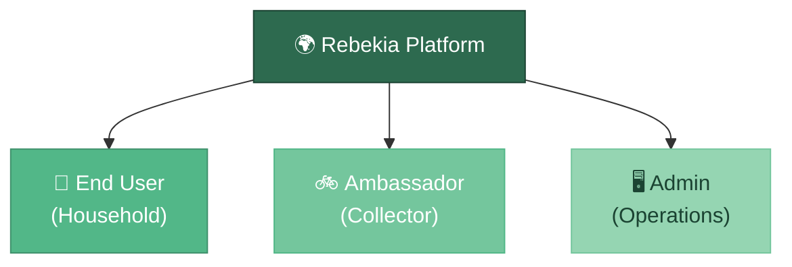

### 2.2 End User (Household)

**Profile:** Egyptian household member (typically female head-of-household), semi-tech-literate, mobile-first, Arabic speaker.

**Goals:**
- Dispose of waste without leaving home
- Earn points and convert to cash/products
- Track ambassador arrival in real-time
- Trust the process (fair weighing, honest points)

**User Journey:**


### 2.3 Ambassador

**Profile:** Independent contractor, mobile worker, manages daily routes in a specific geographic zone.

**Goals:**
- Accept and fulfill collection orders efficiently
- Get fair compensation per kg/type collected
- Manage daily schedule and delivery inventory
- Record weights accurately and transparently

**Ambassador Journey:**


### 2.4 Admin (Operations)

**Profile:** Rebekia internal operations team. Manages ambassadors, monitors platform health, resolves disputes, controls pricing and rewards.

**Admin Goals:**
- Full visibility of all platform activity
- Dispute resolution tooling
- Inventory management for ambassador stock
- Points economy management (pricing, inflation control)
- ESG data aggregation for future B2B use

---

## 3. System Architecture

### 3.1 High-Level Architecture

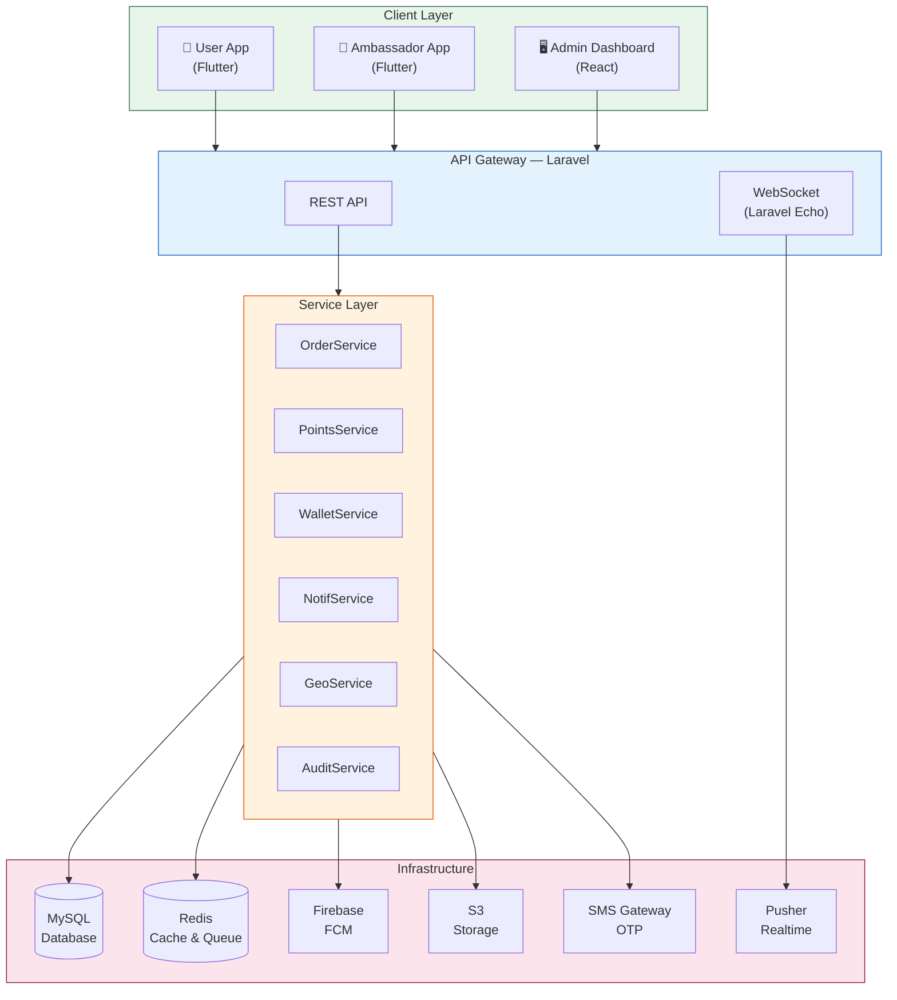

### 3.2 Module Structure (Laravel)

```
app/
├── Http/
│   ├── Controllers/
│   │   ├── Auth/
│   │   │   ├── UserAuthController.php
│   │   │   └── AmbassadorAuthController.php
│   │   ├── User/
│   │   │   ├── OrderController.php
│   │   │   ├── WalletController.php
│   │   │   ├── MarketplaceController.php
│   │   │   ├── ProfileController.php
│   │   │   └── TrackingController.php
│   │   ├── Ambassador/
│   │   │   ├── OrderController.php
│   │   │   ├── WeighController.php
│   │   │   ├── InventoryController.php
│   │   │   └── EarningsController.php
│   │   └── Dashboard/           ← Admin controllers
│   │       ├── AdminOrderController.php
│   │       ├── AdminAmbassadorController.php
│   │       ├── AdminUserController.php
│   │       ├── AdminWalletController.php
│   │       ├── AdminPointsController.php
│   │       ├── AdminInventoryController.php
│   │       ├── AdminReportsController.php
│   │       └── AdminDisputeController.php
├── Services/
│   ├── OrderService.php
│   ├── PointsService.php
│   ├── WalletService.php
│   ├── NotificationService.php
│   ├── GeoService.php
│   ├── AuditService.php
│   ├── DisputeService.php
│   └── InventoryService.php
├── Models/
│   ├── User.php
│   ├── Ambassador.php
│   ├── Order.php
│   ├── OrderItem.php
│   ├── WasteCategory.php
│   ├── WasteSubCategory.php
│   ├── PointTransaction.php
│   ├── WalletTransaction.php
│   ├── Wallet.php
│   ├── Product.php
│   ├── Coupon.php
│   ├── PartnerDiscount.php
│   ├── Redemption.php
│   ├── AmbassadorInventory.php
│   ├── Dispute.php
│   ├── Level.php
│   ├── Address.php
│   └── Notification.php
└── Events/
    ├── OrderPlaced.php
    ├── AmbassadorAssigned.php
    ├── AmbassadorEnRoute.php
    ├── WeighCompleted.php
    ├── OrderCompleted.php
    └── PointsAwarded.php
```

---

## 4. Database Schema

The schema is split into three ERDs for readability: **Core Domain**, **Gamification & Wallet**, and **Marketplace & Operations**.

---

### 4.1 ERD — Core Domain (Users, Orders, Waste)

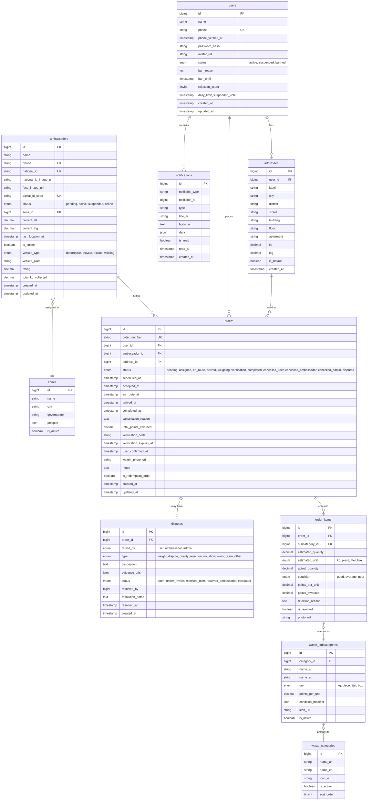

---

### 4.2 ERD — Gamification & Wallet

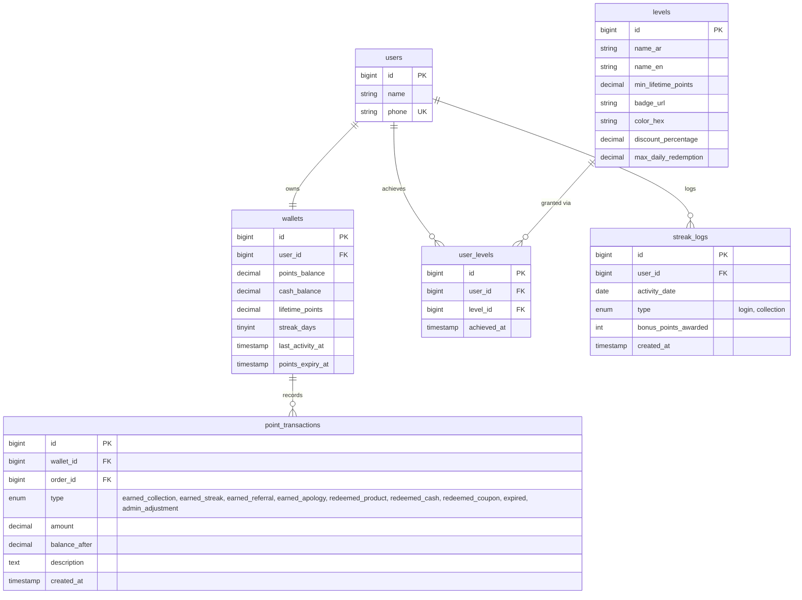

---

### 4.3 ERD — Marketplace & Operations

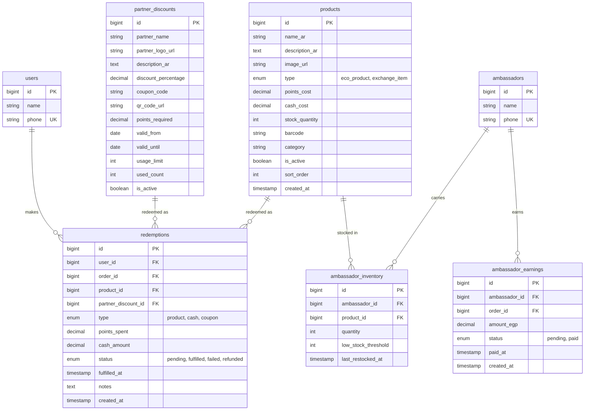

---

### 4.4 Key Design Notes

| Decision | Rationale |
|---|---|
| `lifetime_points` never decrements | Used exclusively for level calculation — spending points must not lower level |
| `points_per_unit` snapshot in `order_items` | Protects existing orders when admin changes pricing mid-day |
| `condition_modifier` as JSON in `waste_subcategories` | Flexible per-subcategory good/average/poor multipliers without extra table |
| `notifiable_type` polymorphic field | Single notifications table serves both users and ambassadors |
| `digital_id_code` on ambassadors | Human-readable security code users verify before opening the door |
| `polygon` as JSON in zones | GeoJSON format, supports any zone shape for geofence lookup |

---

## 5. Feature Specifications — User App

### 5.1 Onboarding & Authentication

#### 5.1.1 Registration Flow

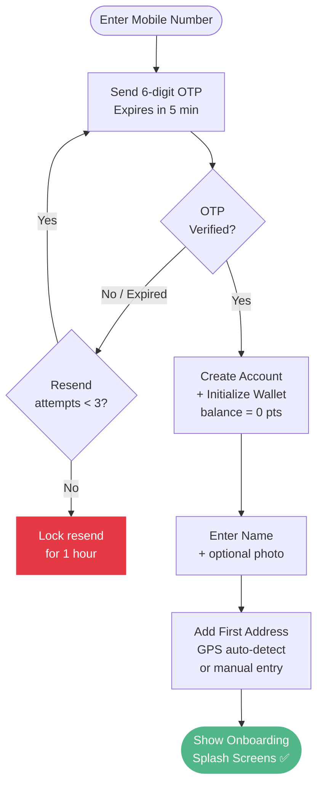

**Business Rules:**
- OTP expires in 5 minutes
- Max 3 OTP resend attempts per hour
- Phone number is the unique account identifier
- Wallet auto-created on successful registration with 0 points

#### 5.1.2 Login Flow

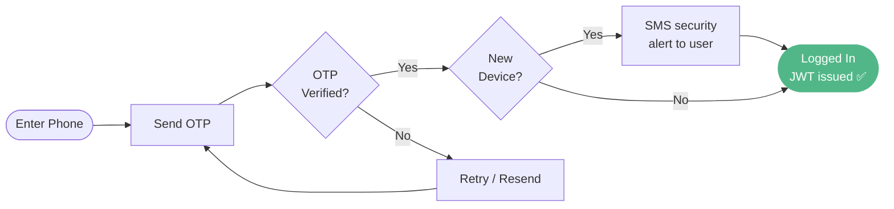

- Session tokens: JWT with 30-day expiry
- Refresh token: 90-day expiry
- Forced re-login on suspicious activity (new device detection)

---

### 5.2 Home Screen

**Data displayed:**
- Greeting with user first name
- Current points balance (with cash equivalent, e.g., "1,200 نقطة = 120 ج.م")
- Current level badge (Bronze / Silver / Gold / Platinum / Elite)
- Progress bar to next level (based on lifetime points)
- Streak counter (daily engagement streak)
- Quick-action buttons: Request Collection, Marketplace, Partner Discounts
- Featured eco-products carousel
- Recent orders summary (last 3)
- Leaderboard snippet ("أنت المركز 5 في حيك")

---

### 5.3 Place Collection Request

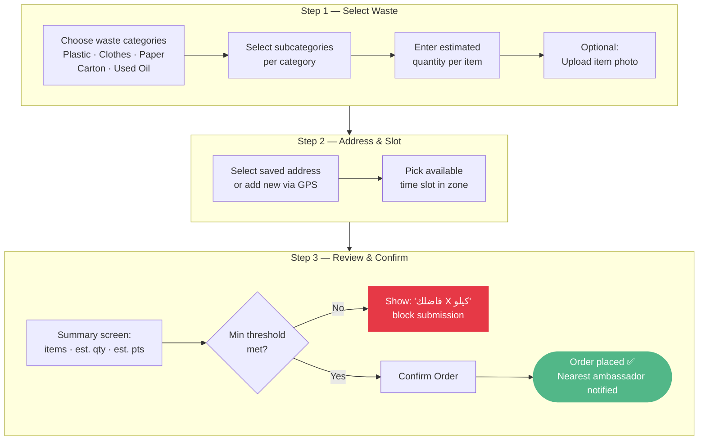

---

### 5.4 Real-Time Order Tracking

**States shown to user:**

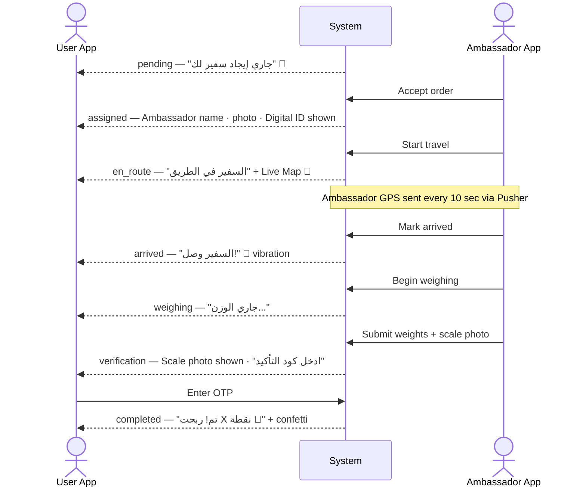

---

### 5.5 Weight Verification (OTP / QR)

**Primary flow (Online):**

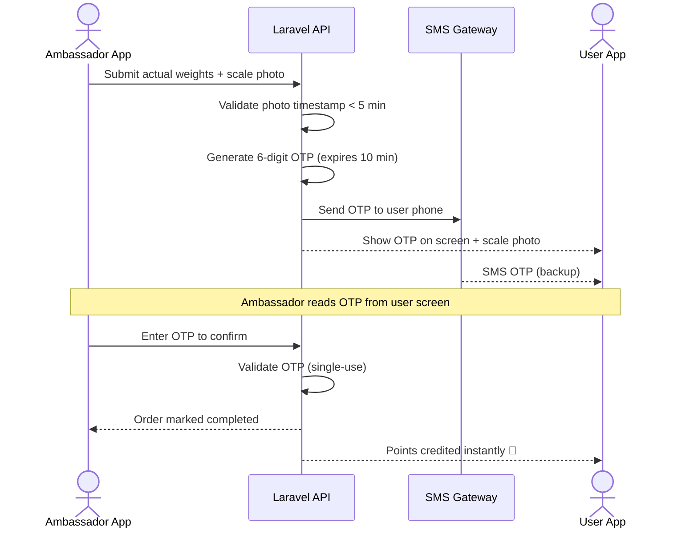

**Fallback flow (Offline / QR):**

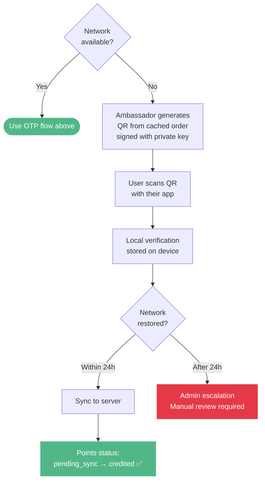

**Security rules:**
- OTP is single-use
- OTP regenerates if ambassador requests resend (old one immediately invalidates)
- Weight photo is mandatory before OTP is generated
- Scale photo appears in user's app before they press "Confirm"

---

### 5.6 Wallet & Points Screen

**Displayed information:**
- Points balance + EGP equivalent
- Cash balance (if any cash redemptions pending payout)
- Lifetime points total
- Current level + progress to next level
- Transaction history (paginated, filterable by type)
- Points expiry warning (banner if expiry < 30 days away)

**Redemption options:**
1. **Cash Payout** — transfer points to cash (min 500 pts = 50 EGP). Payout via Instapay or cash-in-hand via next ambassador visit.
2. **Eco-Products** — redeem for products in Rebekia marketplace
3. **Partner Coupons** — redeem for discount codes at partner businesses

**Redemption guards:**
- PIN or new OTP required for cash redemptions above 200 EGP equivalent
- Daily redemption limit per level (configurable in admin)
- Balance must be sufficient before checkout (no partial advance redemption)

---

### 5.7 Marketplace

#### Eco-Products Tab
- Rebekia-manufactured eco-friendly bags, accessories
- Priced in points
- Categories: أزياء, اكسسورات, الكل
- Product detail: image, description, points cost, stock status
- Add to cart → checkout using points balance
- Products delivered by ambassador on next visit OR scheduled separately

#### Exchange Items Tab
- Everyday items (oil, pasta, sugar, cheese, etc.)
- Priced in points
- Ordered at time of collection request OR standalone order
- Ambassador carries stock; barcode-scanned on delivery

#### Partner Discounts Tab
- List of partner businesses with discount %
- Percentage can vary by user level (Gold users get 15%, Silver get 10%, etc.)
- Coupon code / QR generated on redemption
- Validity period shown

---

### 5.8 Daily Engagement & Streak System

- User earns +10 bonus points for opening the app on consecutive days
- Streak counter resets at midnight Cairo time if no login
- Streak milestones trigger celebration screen (7-day, 30-day, etc.)
- Streak bonus points awarded to wallet silently in background

---

## 6. Feature Specifications — Ambassador App

### 6.1 Ambassador Registration & Verification

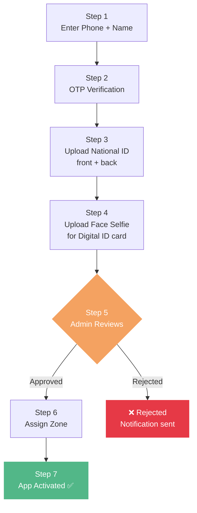

**Ambassador Digital ID card contains:**
- Name
- Photo
- Unique ambassador code (e.g., RBK-AMB-0042)
- Zone name
- Active badge

---

### 6.2 Ambassador Home / Dashboard

- Online/Offline toggle (controls whether orders are dispatched to them)
- Today's stats: orders completed, KGs collected, points issued to users, own earnings
- Pending orders in zone (list)
- Accepted active order (map view)
- Inventory levels summary (low stock warning)
- Earnings summary (pending payout)

---

### 6.3 Order Acceptance & Fulfillment

**Order Notification:**
- Push notification with order summary (address area, waste types, estimated quantity, estimated points)
- Ambassador sees 60-second accept timer; if not accepted, order dispatched to next available ambassador

**Order Detail Screen:**
- User name + address (shown only after acceptance)
- Map navigation to address
- Waste items list (from user's request)
- Scheduled time slot

**Status Transitions (Ambassador Controlled):**

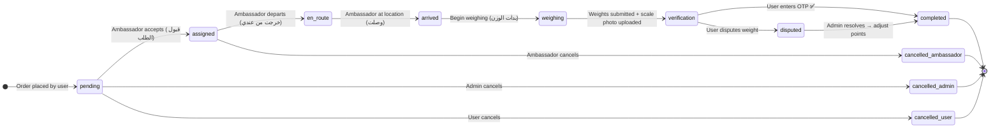

---

### 6.4 Weight Recording

**Per item, ambassador records:**
- Actual quantity (kg / piece / liter)
- Condition: Good (جيد) / Average (متوسط) / Poor (متهالك)
- Reject toggle (if item is unacceptable — contaminated, wrong type)
- If rejected: select reason from dropdown

**After all items recorded:**
- Ambassador takes scale photo using in-app camera (mandatory)
- Photo uploads immediately to S3
- System calculates total points
- Points summary shown to ambassador before submission
- Submit → system generates OTP → user notified

**Rejection flow:**
- Ambassador selects "رفض الصنف" + reason
- Educational notification pushed to user with images of acceptable vs. rejected items
- Rejected item does not earn points
- If 3 total quality rejections on user's account → temporary suspension (configurable)

---

### 6.5 Product Exchange During Collection Visit

- After weighing complete, ambassador checks if user wants product exchange
- Ambassador opens "تسليم منتج" screen
- Scans product barcode → confirms product matches order
- Ambassador's inventory decremented
- Logged in `redemptions` table
- Points or cash deducted from user's wallet

**Stock exhaustion during route:**
- System monitors ambassador inventory in real-time
- When stock < `low_stock_threshold` → warning notification to ambassador + admin
- Affected upcoming users notified: "The ambassador's stock of [product] has run out. Continue for points only, or reschedule?"

---

### 6.6 Ambassador Earnings

- Ambassador earns a fee per kg collected (configured per waste type in admin)
- Fee is NOT points — it is cash, tracked in a separate `ambassador_earnings` table
- Payout schedule: weekly or on-demand (configured)
- Earnings screen shows: today / this week / this month summary

---

## 7. Feature Specifications — Admin Dashboard

### 7.1 Operations Overview (Home)

**Real-time KPIs (live updating):**
- Active orders today
- Ambassadors online right now
- Total KGs collected this month
- Total points issued today
- Pending disputes
- Ambassador no-shows (today)
- Revenue equivalent of points issued (liability tracker)

---

### 7.2 Order Management

**Table view with filters:**
- Filter by: status, zone, ambassador, date range, waste type
- Search by: order number, user phone, ambassador name

**Per-order detail:**
- Full timeline (each status change with timestamp)
- All items with estimated and actual quantities
- Scale photo
- OTP log
- Points awarded breakdown
- Associated dispute (if any)

**Admin actions:**
- Force-complete order (with audit note)
- Cancel order + reason
- Adjust points awarded manually
- Reassign order to different ambassador
- Open dispute on behalf of user

---

### 7.3 Ambassador Management

**Ambassador list:**
- Status filter (online/offline/suspended/pending)
- Zone filter
- KPIs per ambassador: orders today, KGs this week, rejection rate, no-show rate, rating

**Per-ambassador detail:**
- Profile + Digital ID card preview
- Verification documents
- Full order history
- Current inventory levels
- Earnings history
- Pending approval queue (new registrations)

**Admin actions:**
- Approve / reject registration
- Suspend / reactivate ambassador
- Change zone assignment
- Adjust inventory levels (restock)
- View live location on map

---

### 7.4 User Management

**User list with filters:**
- Status: active / suspended / banned
- Level: Bronze → Elite
- Zone / city
- Sort by: points balance, lifetime points, registration date, last activity

**Per-user detail:**
- Profile, level, wallet balance
- Order history
- Transaction history
- Dispute history
- Rejection count (quality strikes)

**Admin actions:**
- Manually award / deduct points (with required reason note, audited)
- Suspend / ban / unban user
- Reset daily redemption limit
- View addresses on map

---

### 7.5 Points Economy Management

**This is the most critical admin panel:**

**Waste Pricing Table:**
- View and edit `points_per_unit` per subcategory
- Change takes effect immediately for new orders (existing order snapshots are protected)
- Audit log of all changes (who changed, old value, new value, timestamp)

**Points Expiry Policy:**
- Global default: X months from last activity
- Admin can set per-user override
- Batch expiry job runs nightly

**Daily Redemption Limits (per level):**
- Configurable limits per level tier
- Admin can override per individual user

**Dynamic Marketplace Pricing:**
- Update product point cost in real-time
- Link product point cost to EGP price index (manual input for v1.0)

---

### 7.6 Dispute Management

**Dispute queue:**
- Filter by type, status, creation date
- SLA indicator (time since opened)

**Per-dispute resolution screen:**
- Order timeline
- Evidence (photos submitted by both parties)
- Scale photo from ambassador
- Item photos from user (if submitted)
- Admin resolution form:
  - Choose outcome: in favor of user / in favor of ambassador / partial resolution
  - Enter resolution notes
  - Trigger point adjustment if needed
  - Mark resolved

---

### 7.7 Inventory Management

**Stock overview:**
- All products with total system stock
- Per-ambassador stock breakdown
- Low-stock alerts (configurable threshold)

**Restock flow:**
- Admin assigns stock units to ambassador
- Ambassador confirms receipt via app
- Inventory record updated

---

### 7.8 Reports & Analytics

**Available reports (exportable as CSV / Excel):**

1. **Collection Report** — Total waste collected by type, by zone, by date range
2. **Ambassador Performance Report** — Orders, KGs, rejection rate, no-show rate per ambassador
3. **Points Economy Report** — Points issued vs. redeemed, outstanding liability, expiry schedule
4. **User Engagement Report** — DAU/MAU, streak distribution, level distribution
5. **Dispute Report** — Volume, type breakdown, resolution time, outcomes
6. **Environmental Impact Report** — CO2 equivalent saved (future ESG data pipeline seed)

---

## 8. API Specifications

### 8.1 Authentication Endpoints

```
POST   /api/v1/auth/send-otp               # Send OTP to phone
POST   /api/v1/auth/verify-otp             # Verify OTP, receive tokens
POST   /api/v1/auth/refresh                # Refresh access token
POST   /api/v1/auth/logout                 # Invalidate token

POST   /api/v1/ambassador/auth/send-otp
POST   /api/v1/ambassador/auth/verify-otp
POST   /api/v1/ambassador/auth/refresh
POST   /api/v1/ambassador/auth/logout
```

### 8.2 User Endpoints

```
# Profile
GET    /api/v1/user/profile
PATCH  /api/v1/user/profile
POST   /api/v1/user/profile/avatar

# Addresses
GET    /api/v1/user/addresses
POST   /api/v1/user/addresses
PATCH  /api/v1/user/addresses/{id}
DELETE /api/v1/user/addresses/{id}
PATCH  /api/v1/user/addresses/{id}/set-default

# Orders
GET    /api/v1/user/orders                 # List with status filter
POST   /api/v1/user/orders                 # Place new order
GET    /api/v1/user/orders/{id}            # Order detail
DELETE /api/v1/user/orders/{id}            # Cancel order
POST   /api/v1/user/orders/{id}/confirm    # Confirm weight (OTP entry)
POST   /api/v1/user/orders/{id}/dispute    # Raise dispute

# Wallet & Points
GET    /api/v1/user/wallet                 # Balance + stats
GET    /api/v1/user/wallet/transactions    # Paginated history
POST   /api/v1/user/wallet/redeem          # Redeem points (product/cash/coupon)

# Tracking
GET    /api/v1/user/orders/{id}/tracking   # Get ambassador live location

# Marketplace
GET    /api/v1/marketplace/products        # Eco-products list
GET    /api/v1/marketplace/products/{id}   # Product detail
GET    /api/v1/marketplace/discounts       # Partner discounts
GET    /api/v1/marketplace/discounts/{id}  # Coupon detail

# Gamification
GET    /api/v1/user/levels                 # All levels
GET    /api/v1/user/leaderboard            # Zone leaderboard

# Waste Categories
GET    /api/v1/waste-categories            # All categories + subcategories with points
```

### 8.3 Ambassador Endpoints

```
# Profile & Status
GET    /api/v1/ambassador/profile
PATCH  /api/v1/ambassador/profile
POST   /api/v1/ambassador/status           # Toggle online/offline
PATCH  /api/v1/ambassador/location         # Update GPS coordinates

# Orders
GET    /api/v1/ambassador/orders/available # Available orders in zone
GET    /api/v1/ambassador/orders/active    # Current active order
GET    /api/v1/ambassador/orders           # Full history
GET    /api/v1/ambassador/orders/{id}      # Order detail
POST   /api/v1/ambassador/orders/{id}/accept
POST   /api/v1/ambassador/orders/{id}/en-route
POST   /api/v1/ambassador/orders/{id}/arrived
POST   /api/v1/ambassador/orders/{id}/weighing
POST   /api/v1/ambassador/orders/{id}/submit-weights
POST   /api/v1/ambassador/orders/{id}/verify-otp
POST   /api/v1/ambassador/orders/{id}/reject-item
POST   /api/v1/ambassador/orders/{id}/cancel

# Inventory
GET    /api/v1/ambassador/inventory
POST   /api/v1/ambassador/inventory/{id}/scan-barcode
POST   /api/v1/ambassador/inventory/confirm-restock

# Earnings
GET    /api/v1/ambassador/earnings         # Summary + history
```

### 8.4 Admin Endpoints

```
# Dashboard
GET    /api/v1/admin/dashboard/kpis
GET    /api/v1/admin/dashboard/live-map    # All online ambassadors

# Orders
GET    /api/v1/admin/orders
GET    /api/v1/admin/orders/{id}
PATCH  /api/v1/admin/orders/{id}
POST   /api/v1/admin/orders/{id}/force-complete
POST   /api/v1/admin/orders/{id}/reassign

# Ambassadors
GET    /api/v1/admin/ambassadors
GET    /api/v1/admin/ambassadors/pending
POST   /api/v1/admin/ambassadors/{id}/approve
POST   /api/v1/admin/ambassadors/{id}/reject
PATCH  /api/v1/admin/ambassadors/{id}/status
PATCH  /api/v1/admin/ambassadors/{id}/zone

# Users
GET    /api/v1/admin/users
GET    /api/v1/admin/users/{id}
PATCH  /api/v1/admin/users/{id}/status
POST   /api/v1/admin/users/{id}/adjust-points

# Points Economy
GET    /api/v1/admin/waste-pricing
PATCH  /api/v1/admin/waste-pricing/{id}
GET    /api/v1/admin/points-config
PATCH  /api/v1/admin/points-config

# Products & Marketplace
GET    /api/v1/admin/products
POST   /api/v1/admin/products
PATCH  /api/v1/admin/products/{id}
DELETE /api/v1/admin/products/{id}

# Inventory
GET    /api/v1/admin/inventory
POST   /api/v1/admin/inventory/restock

# Disputes
GET    /api/v1/admin/disputes
GET    /api/v1/admin/disputes/{id}
POST   /api/v1/admin/disputes/{id}/resolve

# Reports
GET    /api/v1/admin/reports/collection
GET    /api/v1/admin/reports/ambassadors
GET    /api/v1/admin/reports/points-economy
GET    /api/v1/admin/reports/users
GET    /api/v1/admin/reports/environmental
```

### 8.5 Standard API Response Format

```json
{
  "success": true,
  "message": "تم بنجاح",
  "data": { },
  "meta": {
    "current_page": 1,
    "per_page": 20,
    "total": 150
  },
  "errors": null
}
```

---

## 9. Business Logic & Rules Engine

### 9.1 Order Dispatching Logic

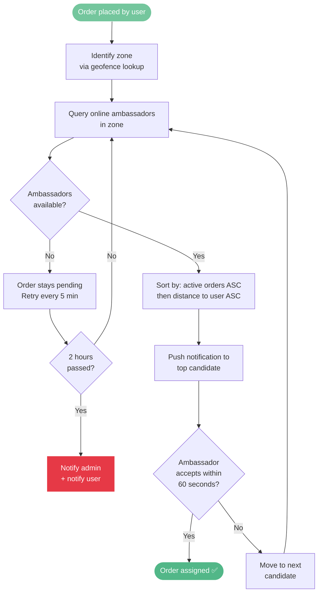

### 9.2 Points Calculation

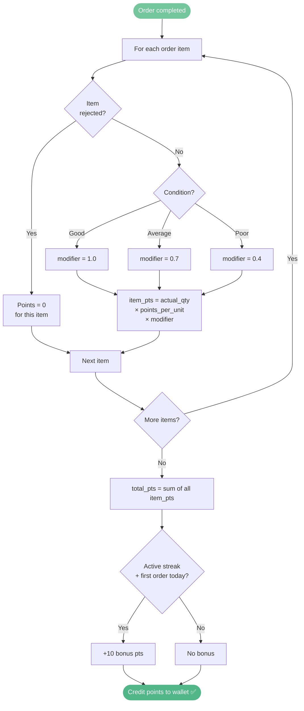

### 9.3 Minimum Order Enforcement

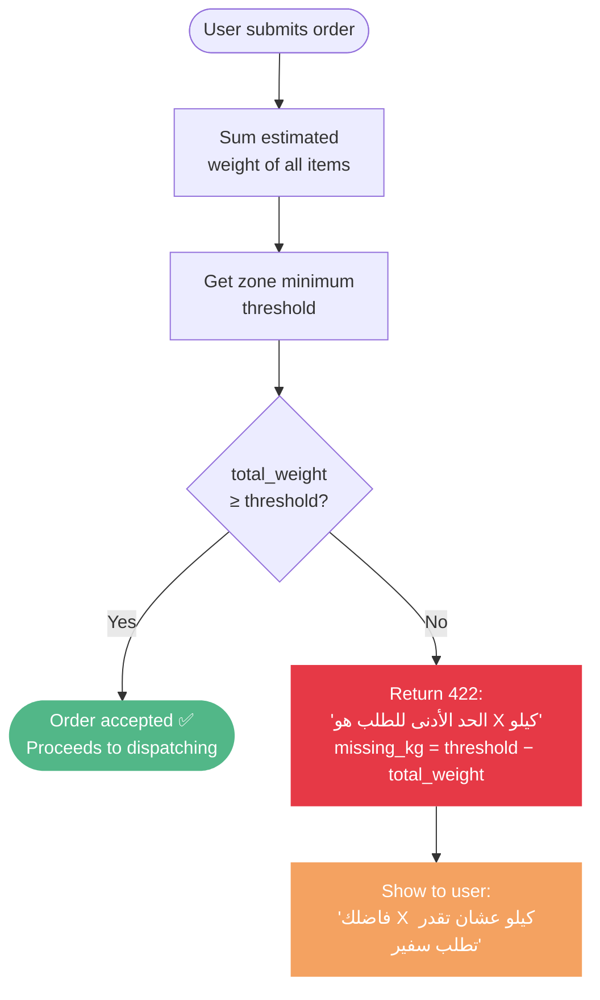

### 9.4 Level Update Logic

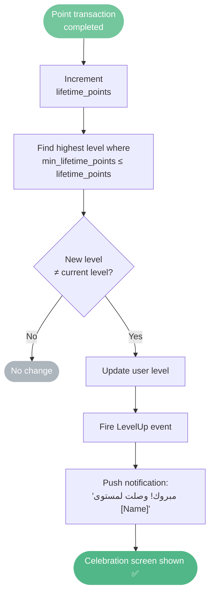

### 9.5 Points Expiry

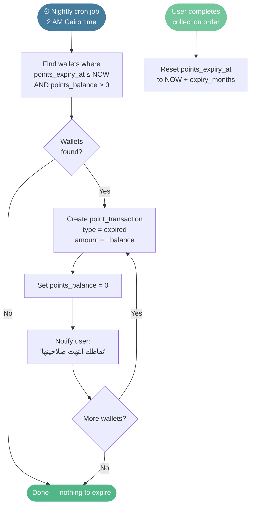

---

## 10. Gamification System

### 10.1 Levels

| Level | Arabic Name | Min Lifetime Points | Badge Color |
|---|---|---|---|
| 1 | عميل برونزي | 0 | Bronze |
| 2 | عميل فضي | 1,500 | Silver |
| 3 | عميل ذهبي | 4,000 | Gold |
| 4 | عميل بلاتيني | 9,000 | Platinum |
| 5 | عميل نخبة | 15,000 | Elite |

### 10.2 Progress Bar

- Shows points earned toward next level
- e.g., "1,200 / 1,500 نقطة للمستوى الفضي"
- Progress bar fills proportionally
- At exact threshold: Level Up animation

### 10.3 Leaderboard

- Scoped to user's zone (حي / district)
- Refreshed every 6 hours
- Shows: rank, username (partial), points this month
- User always sees their own rank even if not in top 10
- No full name or phone shown to other users (privacy)

### 10.4 Streak System

- Login streak: open the app on consecutive days
- Collection streak: complete a collection order each week
- Streak breaks at midnight if not maintained
- Snapchat-style streak counter displayed on home screen
- Bonus: 10 pts/day on daily login streak

### 10.5 Celebration Screens

- Level up → full-screen confetti + new badge reveal
- First order completed → welcome animation
- Major streak milestones (7 days, 30 days)
- Carbon saving milestone (e.g., "You've saved 50 kg CO2 equivalent!")

---

## 11. Wallet & Points System

### 11.1 Dual Display

Always show points alongside their cash equivalent — e.g., **1,200 نقطة ≈ 120 ج.م**. Exchange rate is configurable in admin. Default: 100 pts = 10 EGP (1 pt = 0.1 EGP).

### 11.2 Cash Payout Flow

```mermaid
sequenceDiagram
    actor U as User
    participant App as User App
    participant API as Laravel API
    participant DB as Database
    participant SMS as SMS Gateway
    participant Admin as Admin Dashboard

    U->>App: Request cash payout (min 500 pts)
    App->>U: Enter withdrawal PIN
    U->>App: PIN entered
    App->>SMS: Request OTP (2nd factor)
    SMS-->>U: SMS OTP sent
    U->>App: Enter OTP
    App->>API: POST /wallet/redeem {type: cash, amount}
    API->>DB: Deduct points from wallet
    API->>DB: Create point_transaction (redeemed_cash)
    API->>DB: Create redemption record (status: pending)
    API-->>App: 200 OK — Payout requested
    App-->>U: "جاري تحويل المبلغ"
    Note over Admin,DB: Admin sees pending payout in dashboard
    Admin->>API: Process payout manually / via payment gateway
    API->>DB: Update redemption status → fulfilled
    API->>App: Push notification
    App-->>U: "تم تحويل X جنيه لـ Instapay ✅"
```

### 11.3 Daily Redemption Limits

| Level | Daily Limit |
|---|---|
| Bronze | 500 pts |
| Silver | 1,000 pts |
| Gold | 2,500 pts |
| Platinum | 5,000 pts |
| Elite | Unlimited |

### 11.4 Apology Points

```mermaid
flowchart TD
    A(["⏱️ System monitors\nactive orders"]) --> B{Ambassador late\n> 30 min past slot?}

    B -->|No| A
    B -->|Yes| C[Award 20 apology pts\nto user wallet]
    C --> D["Create point_transaction\ntype = earned_apology"]
    D --> E["Push notification to user:\n'نعتذر عن التأخير، أهديناك 20 نقطة'"]
    E --> F[Log event for\nambassador performance tracking]

    style A fill:#457b9d,color:#fff,stroke:none
    style C fill:#f4a261,color:#fff,stroke:none
    style E fill:#52b788,color:#fff,stroke:none
```

---

## 12. Notifications & Real-Time Events

### 12.1 Push Notification Events (Firebase FCM)

| Event | Recipient | Message |
|---|---|---|
| Order placed | User | "طلبك وصلنا، جاري إيجاد سفير" |
| Ambassador assigned | User | "تم تعيين السفير [Name]، هيوصلك قريباً" |
| Ambassador en route | User | "السفير في الطريق إليك" |
| Ambassador arrived | User | "السفير وصل!" |
| Weight verified | User | "تم! ربحت [X] نقطة" |
| Level up | User | "مبروك! وصلت لمستوى [Name]" |
| Points expiry warning | User | "نقاطك هتنتهي في 30 يوم، استخدمها دلوقتي" |
| New order available | Ambassador | "طلب جديد في منطقتك" |
| Low inventory | Ambassador | "تحذير: مخزون [Product] أوشك على النفاذ" |
| New dispute | Admin | "نزاع جديد على الأوردر #{id}" |

### 12.2 WebSocket Channels (Pusher / Laravel Echo)

```mermaid
flowchart LR
    subgraph Channels["Pusher Channels"]
        C1["`private-order.{order_id}`"]
        C2["`private-ambassador.{id}`"]
        C3["`private-admin`"]
    end

    subgraph Events["Events"]
        E1["AmbassadorLocationUpdated\nevery 10 sec while en_route"]
        E2["OrderStatusChanged"]
        E3["NewOrderAvailable\n60-sec accept window"]
        E4["NewDispute"]
        E5["AmbassadorWentOffline"]
    end

    subgraph Subscribers["Subscribers"]
        U["👤 User App"]
        A["🚲 Ambassador App"]
        O["🖥️ Admin Dashboard"]
    end

    C1 --> E1 --> U
    C1 --> E2 --> U
    C1 --> E2 --> A
    C2 --> E3 --> A
    C3 --> E4 --> O
    C3 --> E5 --> O
```

### 12.3 SMS Notifications

- OTP codes (via SMS gateway, e.g., Vodafone Gateway / Twilio)
- Critical security events (new device login, large cash withdrawal)
- Fallback when push notification fails

---

## 13. Security & Fraud Prevention

### 13.1 Authentication Security

- JWT access tokens (15-minute expiry)
- Refresh tokens (30-day expiry, rotation on use)
- Device fingerprinting stored per user
- New device login → SMS alert to user
- Account lockout after 5 failed OTP attempts (1-hour lockout)

### 13.2 Ambassador Identity Verification

- Every order shows the user the assigned ambassador's: name, photo, digital ID code
- User verifies identity before opening door
- Digital ID code changes monthly (rotated by admin)
- Ambassador app uses certificate pinning

### 13.3 Weight Fraud Prevention

- Scale photo mandatory before OTP generation
- Scale photo timestamp verified (must be < 5 minutes before submission)
- Photo stored immutably in S3 with order record
- User receives photo in their app before confirming
- User has "Dispute Weight" button before confirming

### 13.4 Points Theft Prevention

- High-value redemption (> configurable threshold) requires:
  - PIN entry
  - SMS OTP (separate from login OTP)
- Daily redemption limits per level (see Section 11.3)
- Suspicious activity flags:
  - Multiple redemptions in rapid succession
  - Redemptions from new/different device

### 13.5 Spam Request Prevention

- Minimum order threshold (see Section 9.3)
- Rate limit: max 2 pending orders per user at a time
- Geofence validation: address must be within a served zone
- Time slot validation: cannot request same-day slot with < 2-hour lead time

### 13.6 Account Abuse

- Quality rejection count per user
- At 3 rejections: auto-suspend + educational notification
- Admin review required to reinstate
- Repeat abuse → permanent ban

### 13.7 API Security

- Rate limiting: 60 requests/minute per token
- All endpoints require authentication (except OTP flow)
- Admin endpoints: separate JWT with role claims
- Input validation on all request bodies
- SQL injection prevention via Eloquent ORM
- File upload validation: type, size, content-type header

---

## 14. Edge Cases & Resolution Protocols

### 14.1 Ambassador No-Show

**Detection:** Order status stays `assigned`/`en_route` for more than 45 minutes beyond scheduled slot.

```mermaid
flowchart TD
    A(["⏱️ Order in assigned/en_route\nstatus"]) --> B{45 min past\nscheduled slot?}
    B -->|No| A
    B -->|Yes| C[Flag: ambassador_late]
    C --> D["Notify user:\n'السفير تأخر، نحاول إيجاد بديل'"]
    C --> E[Credit 20 apology pts]
    C --> F[Notify admin]
    D & E & F --> G{Ambassador\nresponds within\n60 min?}
    G -->|Yes| H([Order continues normally])
    G -->|No| I{Admin\ndecision}
    I -->|Reassign| J[Dispatch to next ambassador]
    I -->|Cancel| K[Cancel order\n+ full apology pts]

    U([User presses\n'السفير تأخر']) -->|Manual| F

    style H fill:#52b788,color:#fff,stroke:none
    style K fill:#f4a261,color:#fff,stroke:none
```

---

### 14.2 Weight Dispute

**Trigger:** User presses "اعتراض على الوزن" before confirming OTP.

```mermaid
flowchart TD
    A([User presses\n'اعتراض على الوزن'\nbefore OTP confirm]) --> B[Order status → disputed]
    B --> C[Dispute record created\ntype = weight_dispute]
    C --> D["Both apps show:\n'Order under review'"]
    D --> E[Admin reviews:\nscale photo + submitted weights\nvs. user's estimate]
    E --> F{Admin\ndecision}
    F -->|Favor user| G[Adjust points upward\n+ notify both]
    F -->|Favor ambassador| H[Keep original points\n+ notify both]
    F -->|Partial| I[Split adjustment\n+ notify both]
    F -->|Request re-visit| J[Schedule new weighing\nwith same ambassador]

    style G fill:#52b788,color:#fff,stroke:none
    style H fill:#457b9d,color:#fff,stroke:none
    style I fill:#f4a261,color:#fff,stroke:none
    style J fill:#74c69d,color:#fff,stroke:none
```

---

### 14.3 Insufficient Points at Checkout

**Prevention:** Marketplace checkout button is disabled if user's current points_balance < product.points_cost.

**Display:** Show "يلزمك X نقطة إضافية" with "اطلب تجميع الآن" shortcut.

**Hybrid payment:** User can pay partial in points + cash (if admin enables this feature).

---

### 14.4 Contaminated / Low-Quality Waste

```mermaid
flowchart TD
    A([Ambassador finds\nunacceptable item]) --> B["Select 'رفض الصنف'\n+ pick reason"]
    B --> C[Send educational\nnotification to user\nwith images of\nacceptable vs rejected]
    C --> D[Item points = 0]
    D --> E[Increment\nuser rejection_count]
    E --> F{rejection_count\n≥ 3?}
    F -->|No| G([Continue with\nother items])
    F -->|Yes| H[Auto-suspend account\nban_until = NOW + 7 days]
    H --> I["Notify user:\n'تم تعليق حسابك مؤقتاً'"]
    I --> J[Admin review\nrequired to reinstate]

    style G fill:#52b788,color:#fff,stroke:none
    style H fill:#e63946,color:#fff,stroke:none
    style J fill:#f4a261,color:#fff,stroke:none
```

---

### 14.5 Offline / Low Connectivity

```mermaid
flowchart TD
    A([Ambassador at user location]) --> B{Network\navailable?}
    B -->|Yes| C([Proceed with\nOTP flow ✅])
    B -->|No| D[Cache order data\nlocally SQLite]
    D --> E[Generate signed QR\nfrom cached data]
    E --> F[User scans QR\nwith their app]
    F --> G[Local verification\nsaved on both devices]
    G --> H{Network\nrestored?}
    H -->|Within 24h| I[Sync transaction\nto server]
    I --> J[Points: pending_sync → credited ✅]
    H -->|After 24h| K[Escalate to admin\nManual review]

    style C fill:#52b788,color:#fff,stroke:none
    style J fill:#52b788,color:#fff,stroke:none
    style K fill:#e63946,color:#fff,stroke:none
```

---

### 14.6 Ambassador Inventory Exhaustion

**Detection:** ambassador_inventory.quantity = 0 for product requested in pending redemption.

```mermaid
flowchart TD
    A(["⚠️ ambassador_inventory\nquantity = 0"]) --> B{When\ndetected?}
    B -->|Before shift start| C["Warn ambassador:\n'مخزونك غير كافي لطلبات اليوم'"]
    B -->|During route| D["Notify affected users:\n'نفذ [منتج] من عهدة السفير'"]
    D --> E{User\nchoice}
    E -->|Points only| F([Continue — no product\nPoints credited normally])
    E -->|Reschedule| G([New delivery slot\nscheduled])
    E -->|Wait for restock| H([Hold order\npending restock])
    A --> I[Notify admin\nfor emergency restock]

    style F fill:#52b788,color:#fff,stroke:none
    style G fill:#74c69d,color:#fff,stroke:none
    style H fill:#f4a261,color:#fff,stroke:none
```

---

### 14.7 Wrong Product Delivered

**Detection:** Ambassador failed to scan barcode OR user reports wrong item.

```mermaid
flowchart TD
    A([User receives\nwrong product]) --> B["Press 'إبلاغ عن مشكلة\nفي المنتج' in history"]
    B --> C[Dispute created\ntype = wrong_item]
    C --> D[Admin reviews:\nbarcode scan log\n+ ambassador notes]
    D --> E{Resolution}
    E -->|Replacement| F[Schedule replacement\non next ambassador visit]
    E -->|Compensation| G[Credit points\nto user wallet]

    P([Ambassador\ndelivers product]) --> Q{Barcode\nscanned?}
    Q -->|Yes — matches| R([Delivery confirmed ✅])
    Q -->|No / Mismatch| S[Delivery blocked\nAmbassador must\ncorrect product]

    style R fill:#52b788,color:#fff,stroke:none
    style F fill:#74c69d,color:#fff,stroke:none
    style G fill:#52b788,color:#fff,stroke:none
    style S fill:#e63946,color:#fff,stroke:none
```

---

### 14.8 Points Inflation Risk

```mermaid
mindmap
  root((Points Inflation\nRisk))
    Dynamic Pricing
      Admin updates points_per_unit\nper subcategory in real-time
      Marketplace prices updated\nto match EGP market rate
    Points Expiry
      Nightly job expires\nunused balances
      Forces circulation\nprevents accumulation
    Redemption Limits
      Per-level daily caps
      High-value actions\nrequire PIN + OTP
    Cash Liability Tracker
      Admin sees total\noutstanding pts in EGP
      Helps forecast\npayout obligations
```

---

## 15. Non-Functional Requirements

### 15.1 Performance

| Metric | Target |
|---|---|
| API p95 response time | < 300ms |
| Live tracking update latency | < 3 seconds |
| Push notification delivery | < 5 seconds |
| OTP delivery (SMS) | < 30 seconds |
| App cold start | < 3 seconds |
| Image upload | < 5 seconds (scale photo) |

### 15.2 Scalability

- Horizontal scaling for API layer via load balancer
- Redis for session storage and queue management
- Database read replicas for reporting queries
- S3-compatible storage for all media (no local disk)
- Queue workers for: OTP sending, notification dispatch, points calculation, report generation

### 15.3 Availability

- Target uptime: 99.5% (allows ~22 hours downtime/year)
- Graceful degradation: if Pusher unavailable, fall back to polling every 10 seconds
- Offline-first ambassador app (see 14.5)

### 15.4 Localization

- All user-facing content in Arabic (RTL)
- Admin dashboard: Arabic + English toggle
- All dates displayed in Cairo timezone (UTC+2 / UTC+3 during DST)
- Currency: Egyptian Pound (EGP)
- Number formatting: Arabic-Indic numerals optional (admin toggle)

### 15.5 Accessibility

- Minimum touch target size: 44×44 px
- High contrast color palette
- Font size: minimum 14sp for body text
- VoiceOver / TalkBack compatibility for primary flows

---

## 16. Tech Stack

### 16.1 Backend

| Component | Technology |
|---|---|
| API Framework | Laravel 11 |
| Language | PHP 8.3 |
| Database | MySQL 8.0 |
| Cache | Redis 7 |
| Queue Driver | Redis (Laravel Horizon) |
| Real-time | Pusher + Laravel Echo |
| Push Notifications | Firebase Cloud Messaging (FCM) |
| SMS Gateway | Vodafone Gateway / Twilio (fallback) |
| File Storage | AWS S3 / MinIO (self-hosted option) |
| Admin Auth | Laravel Sanctum + role middleware |

### 16.2 Mobile Apps

| Component | Technology |
|---|---|
| Framework | Flutter 3 |
| State Management | BLoC / Riverpod |
| Maps | Google Maps SDK |
| Real-time | Pusher Flutter SDK |
| Local Storage | SQLite (offline sync) |
| Camera | flutter_camera |
| QR | qr_code_scanner / qr_flutter |
| Notifications | firebase_messaging |

### 16.3 Admin Dashboard

| Component | Technology |
|---|---|
| Framework | React 18 |
| UI Library | Ant Design or ShadCN/UI |
| State | Redux Toolkit or Zustand |
| Charts | Recharts or ApexCharts |
| Maps | Google Maps JS API |
| Real-time | Pusher JS SDK |

---

## 17. Deployment & Infrastructure

### 17.1 Environments

| Environment | Purpose |
|---|---|
| Development | Local developer machines |
| Staging | QA testing, UAT with real ambassadors |
| Production | Live platform |

### 17.2 Server Configuration (Production v1.0)

```mermaid
flowchart TB
    LB["🌐 Nginx\nLoad Balancer / Proxy"]

    subgraph App["Application Layer"]
        API["⚙️ App Server\nLaravel API\n2× vCPU · 4GB RAM"]
        Q["📋 Queue Workers\nLaravel Horizon\n1× vCPU · 2GB RAM"]
    end

    subgraph Data["Data Layer"]
        DB[("🗄️ MySQL\nDatabase\n2× vCPU · 8GB RAM\n+ Daily Backups")]
        RD[("⚡ Redis\nCache & Queue\n1× vCPU · 2GB RAM")]
    end

    subgraph External["External Services"]
        S3["☁️ S3 Bucket\nMedia Storage"]
        PU["📡 Pusher\nWebSockets"]
        FB["🔔 Firebase\nFCM Push"]
        SMS["📱 SMS Gateway\nOTP"]
    end

    LB --> API
    API --> Q
    API --> DB
    API --> RD
    Q --> DB
    Q --> RD
    API --> S3
    API --> PU
    API --> FB
    API --> SMS

    style App fill:#e3f2fd,stroke:#1565c0
    style Data fill:#fce4ec,stroke:#880e4f
    style External fill:#e8f5e9,stroke:#2d6a4f
```

### 17.3 CI/CD

- GitHub Actions for CI (run tests on each PR)
- Staging auto-deploy on merge to `develop`
- Production deploy: manual trigger on merge to `main`
- Zero-downtime deployments via Laravel Envoyer or custom deploy scripts

### 17.4 Monitoring

- Sentry (error tracking — production errors, daily debug log review monthly)
- Laravel Telescope (local + staging only)
- Laravel Horizon dashboard (queue health)
- Uptime monitoring via UptimeRobot or Better Uptime
- Admin dashboard KPIs as primary operational monitoring layer

---

## 18. Open Questions & Future Scope

### 18.1 Open Questions (To Resolve Before Engineering Kickoff)

| # | Question | Owner |
|---|---|---|
| 1 | Which SMS gateway has best Egyptian mobile coverage? Vodafone vs. others? | Tech + Ops |
| 2 | Cash payout: Instapay API integration or manual processing in v1? | Product + Finance |
| 3 | What is the exact minimum order threshold per zone? | Operations |
| 4 | Are all redemption items physically carried by ambassadors, or some are postal? | Operations |
| 5 | How is ambassador compensation calculated per kg? Flat rate or type-variable? | Finance |
| 6 | Who handles disputes > 24h unresolved? Escalation path? | Operations |
| 7 | Is the admin dashboard accessible on mobile or desktop-only? | Product |
| 8 | Will the eco-product marketplace go live at launch or post-launch? | Product |

### 18.2 Future Scope (v2.0 — 2027)

- **B2B ESG / EDR Reports** — sell environmental data to corporates and government
- **AI Route Optimization** — optimize ambassador routes to maximize KG collection
- **Carbon Credit Calculation** — gamified environmental impact tracker
- **Multi-City Expansion** — multi-zone, multi-governorate support
- **Ambassador Rating System** — user-driven quality scoring
- **Referral Program** — user earns bonus points for referring neighbors
- **Community Features** — neighborhood recycling leaderboard, shared milestones
- **Third-party Logistics Integration** — connect with existing delivery networks for zones without ambassadors
- **Automated Instapay Payouts** — automated cash settlement for users

---

*Document prepared for Rebekia engineering team. All business logic and thresholds are configurable unless marked as fixed. Pricing, point values, and limits should be reviewed by operations before launch.*